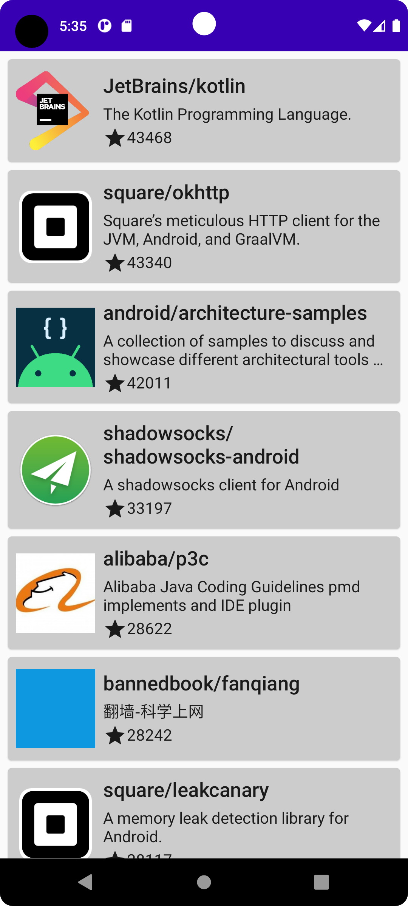
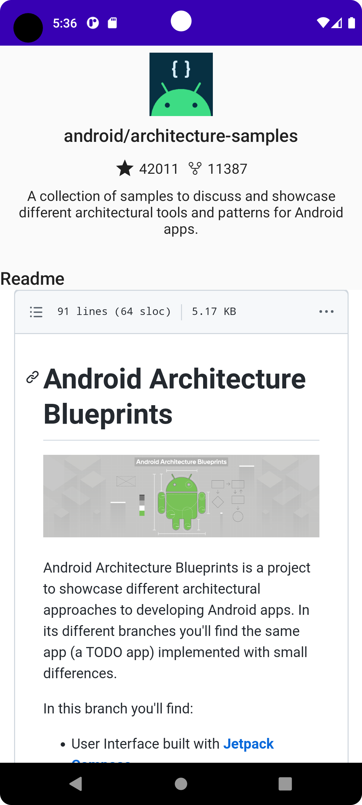

# Github Trends


Android app that shows latest updated repos on GitHub for Kotlin Language

# 📷 Previews
Download [apk](https://drive.google.com/file/d/1U4SNoN6jobaEwXyTJll-THSJO92tSafd/view?usp=share_link). Watch [video](https://drive.google.com/drive/folders/11qSVAmZHwyKaxpnlL5h3iLfNRyMieR15?usp=share_link)
<p align="center">
  
  
</p>

# 🛠 Tech Sacks & Open Source Libraries

- Jetpack Compose
- ViewModel
- Hilt
- Compose Navigation
- Room
- DataStore
- Retrofit
- moshi

# File structure

<details>
    <summary>Click me</summary>

  ```
githubtrends
    │   MainActivity.kt
    │   RepoApplication.kt
    │
    ├───data
    │   ├───local
    │   │       RepoDao.kt
    │   │       RepoDatabase.kt
    │   │
    │   ├───model
    │   │       Owner.kt
    │   │       Repo.kt
    │   │
    │   ├───remote
    │   │       GithubApi.kt
    │   │       RepoSearchResponse.kt
    │   │
    │   └───repository
    │           RepoRepositoryImpl.kt
    │
    ├───di
    │       AppModule.kt
    │       RepositoryModule.kt
    │
    ├───domain
    │   └───repository
    │           RepoRepository.kt
    │
    ├───presentation
    │   ├───navigation
    │   │       NavGraph.kt
    │   │       Screen.kt
    │   │
    │   ├───repo_details
    │   │       RepoDetailsScreen.kt
    │   │       RepoDetailsState.kt
    │   │       RepoDetailsViewModel.kt
    │   │
    │   └───repo_listings
    │           RepoItem.kt
    │           RepoListingsScreen.kt
    │           RepoListingsState.kt
    │           RepoListingsViewModel.kt
    │
    ├───ui
    │   └───theme
    │           Color.kt
    │           Shape.kt
    │           Theme.kt
    │           Type.kt
    │
    └───util
            DataStoreUtil.kt
            Resource.kt
  ```

</details>


